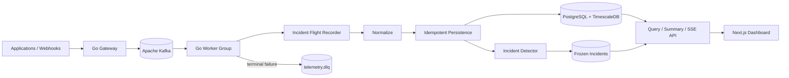

# TelemetryForge Architecture

TelemetryForge is a distributed telemetry control plane built around a simple
rule: **accept telemetry durably, process it predictably, and preserve enough
evidence to explain failures later**.

For the detailed documentation set, start with the [documentation index](docs/README.md).

## System at a glance



## Runtime components

### Gateway

The Go gateway owns the public HTTP boundary. It validates the canonical event
envelope and waits for Kafka acknowledgement before returning `202 Accepted`.
It also exposes bounded query, dashboard summary, incident, and SSE endpoints.

### Kafka

Kafka is the durable boundary between ingestion and processing. Records are
partitioned by telemetry source, which preserves per-source ordering while
allowing independent sources to spread across partitions.

### Workers

Workers consume through a Kafka consumer group. A bounded in-process queue
provides backpressure, and processing uses a fixed concurrency ceiling.

The current pipeline is:

```text
Flight Recorder -> normalization -> idempotent persistence -> incident detection
```

### PostgreSQL / TimescaleDB

TimescaleDB stores time-oriented telemetry while ordinary PostgreSQL tables
store global event-ID deduplication and incident metadata. Database writes are
transactional so a duplicate Kafka delivery becomes a safe no-op.

### Dashboard

The Next.js dashboard reads through the Go API. It does not connect directly to
Kafka or PostgreSQL. Live telemetry uses Server-Sent Events backed by shared
durable storage rather than process-local memory.

## Reliability guarantees

TelemetryForge currently provides these explicit guarantees:

1. **Durable ingestion acknowledgement.** The gateway does not return `202`
   until Kafka acknowledges the record.
2. **Bounded worker memory.** Backlog grows in Kafka rather than an unbounded Go
   queue.
3. **At-least-once processing.** Kafka offsets are committed after successful
   processing, not before it. Concurrent completion cannot commit past earlier
   unfinished work in the same partition.
4. **Rebalance-safe batches.** A bounded poll batch retains partition ownership
   until all submitted jobs have finished normal or dead-letter handling.
5. **Idempotent persistence.** Canonical event IDs protect against duplicate
   database rows after retries or rebalances.
6. **Durable terminal failure handling.** Source offsets are committed only
   after Kafka accepts the DLQ replacement.
7. **Pre-normalization incident evidence.** The Flight Recorder preserves the
   incoming decoded envelope before processing modifies it.

## Architectural boundaries

The project intentionally does **not** claim exactly-once end-to-end semantics.
It uses at-least-once delivery plus idempotency because that contract is easier
to reason about and verify with the current persistence model.

The local Docker Compose stack is a development environment. Authentication,
tenant isolation, Kafka TLS/SASL, production secret management, and
policy-driven redaction are not complete yet. See [SECURITY.md](SECURITY.md).

## Key design records

Architectural choices are recorded as ADRs under [`docs/adr/`](docs/adr/).
The most important current decisions include Kafka, source partitioning,
bounded workers, manual offset acknowledgement, TimescaleDB, idempotent event
storage, classified retry/DLQ handling, the Flight Recorder, durable-store SSE, explicit automatic incident thresholds, and coordinated
concurrent Kafka acknowledgements/rebalances.
