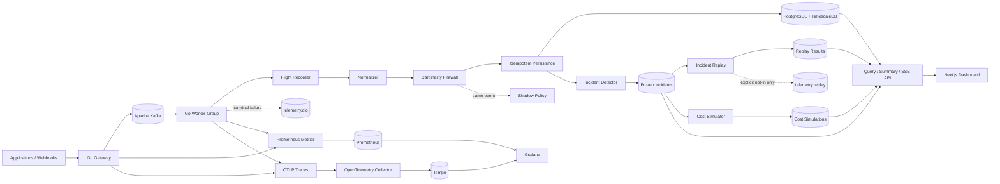

# TelemetryForge

[](https://github.com/fuhrdan/TelemetryForge/actions/workflows/ci.yml)
[](https://go.dev/)
[](https://kubernetes.io/)
[](https://www.terraform.io/)
[](https://opentelemetry.io/)
[](LICENSE)

**Distributed, event-driven telemetry control plane and observability gateway.**

TelemetryForge sits between applications and observability backends. It accepts
telemetry, buffers it durably through Kafka, processes it with bounded Go
workers, protects downstream systems from cardinality explosions, preserves
full-fidelity incident evidence, and gives operators a safe place to replay
production incidents and compare telemetry policy before changing live traffic.

> **Current release:** `v0.9.0` — Incident Replay, Telemetry Cost Simulator,
> self-observability, broker-derived Kafka lag, and reproducible k6 methodology.

## Why TelemetryForge is different

TelemetryForge is not trying to replace Datadog, Grafana, Splunk, Honeycomb, or
another observability backend. It focuses on the **telemetry control plane
before those systems**.

Implemented differentiators:

- **Incident Flight Recorder** — keeps a rolling pre-policy, full-fidelity
  telemetry window.
- **Automatic Incident Capture** — freezes evidence when deterministic
  latency/error thresholds cross.
- **Cardinality Firewall** — detects dangerous label growth and can `allow`,
  `drop_tag`, or `quarantine`.
- **Policy-as-Code** — versioned JSON policy with strict validation.
- **Shadow Pipeline** — evaluates candidate policy without changing active
  telemetry behavior.
- **Incident Replay** — re-runs frozen evidence through normalization and policy
  without normal production side effects.
- **Telemetry Cost Simulator** — compares sample bytes/series and monthly volume
  projections before a policy is promoted.
- **Evidence-first self-observability** — Prometheus metrics, OpenTelemetry
  traces, broker-derived consumer lag, Grafana dashboards, and bounded labels.

Still planned for `v1.0.0`:

- **Evidence Graph**
- security/tenant hardening
- production-grade runbooks and deployment profiles
- replay/cost evidence integrated into a polished incident investigation flow

See [ROADMAP.md](ROADMAP.md).

## v0.9.0 architecture



For reliability and ownership guarantees, read
[ARCHITECTURE.md](ARCHITECTURE.md).

## Current capabilities

| Area | Current behavior |
|---|---|
| Ingestion | Go HTTP API with versioned canonical envelope |
| Durable handoff | Kafka acknowledgement before HTTP `202` |
| Processing | Consumer groups, bounded workers, backpressure |
| Delivery | At-least-once with contiguous per-partition commits and rebalance-safe poll batches |
| Reliability | Classified retries, backoff/jitter, DLQ, idempotent persistence |
| Persistence | PostgreSQL + TimescaleDB |
| Incident evidence | 30-minute pre-policy Flight Recorder |
| Incident capture | Manual and automatic freezing |
| Cardinality | Fixed 16-hash exact window + bounded 64-register HLL |
| Policy | Active JSON policy + candidate shadow policy |
| Policy actions | `allow`, `drop_tag`, `quarantine` |
| Incident Replay | Side-effect-free analysis by default; optional isolated `telemetry.replay*` output |
| Cost simulation | Sample bytes/series + monthly volume; dollars only with explicit pricing |
| Metrics | Low-cardinality Prometheus metrics for gateway/worker behavior |
| Tracing | Sampled OpenTelemetry traces with Kafka Trace Context propagation |
| Kafka lag | Broker-derived committed-offset versus end-offset lag |
| Live UI | SSE operations dashboard plus incident/replay/cost/policy history |
| Kubernetes | Kustomize base, probes, HPA, PDB, scrape annotations |
| Terraform | AWS VPC + EKS foundation |
| Load testing | Pinned k6 smoke, sustained, and backpressure scenarios |
| Operations | `telemetryctl` incident/replay/cost/DLQ/dedup/policy commands |

## Quickstart

Requirements:

- Docker with Docker Compose
- optional direct development: Go 1.27.1+ and Node.js 24 LTS

Start the complete local stack:

```bash
docker compose up --build
```

Open:

```text
TelemetryForge UI: http://localhost:3000
Gateway API:       http://localhost:8080
Grafana:           http://localhost:3001
Prometheus:        http://localhost:9090
Tempo:             http://localhost:3200
```

Local Grafana credentials:

```text
admin / telemetryforge
```

Those credentials and the exposed observability ports are development-only.

Generate normal traffic:

```bash
make demo-traffic
```

Trigger automatic incident capture:

```bash
make demo-incident
```

Exercise the Cardinality Firewall:

```bash
make demo-cardinality
```

## Incident Replay

Replay a frozen incident through the active and shadow policies:

```bash
go run ./cmd/telemetryctl incident replay \
  --id INC-2026-0042 \
  --policy policies/active.json \
  --shadow-policy policies/shadow.json
```

Default replay is **analysis-only**. It does not write to the primary telemetry
table, Flight Recorder, or production ingestion topics.

Optional Kafka publication requires an explicit isolated replay namespace:

```bash
go run ./cmd/telemetryctl incident replay \
  --id INC-2026-0042 \
  --publish-topic telemetry.replay.policy-test
```

The replay library and CLI both reject production ingest topics.

Read [Incident Replay](docs/incidents/replay.md).

## Telemetry Cost Simulator

Compare the frozen incident sample before/after policy:

```bash
go run ./cmd/telemetryctl cost simulate \
  --incident INC-2026-0042 \
  --policy policies/active.json \
  --shadow-policy policies/shadow.json
```

Without pricing inputs, TelemetryForge reports measurable telemetry effects:

- sample canonical JSON bytes
- exact distinct sample series
- active/shadow changed events
- projected monthly volume

It **does not invent a dollar figure**.

Dollar estimates require an explicitly reviewed pricing JSON file:

```bash
go run ./cmd/telemetryctl cost simulate \
  --incident INC-2026-0042 \
  --pricing pricing/my-reviewed-model.json
```

The checked-in [`pricing/example.json`](pricing/example.json) intentionally uses
zero prices.

Read [Telemetry Cost Simulator](docs/cost/cost-simulator.md).

## Self-observability

Gateway metrics:

```text
GET http://localhost:8080/metrics
```

Worker metrics:

```text
GET http://localhost:8081/metrics
```

The local stack provisions:

- Prometheus 3.13.3
- Grafana 13.2.1
- OpenTelemetry Collector 0.160.0
- Tempo 3.0.2

Prometheus labels deliberately avoid event IDs, incident IDs, correlation IDs,
arbitrary source names, raw URL paths, and arbitrary telemetry tags.

HTTP metrics use registered route patterns such as:

```text
GET /api/v1/incidents/{id}/events
```

rather than the raw incident ID.

Trace Context/Baggage is propagated through Kafka record headers so an ingest
request can be followed into worker processing.

Read:

- [Self-observability](docs/observability/self-observability.md)
- [Metrics catalog](docs/observability/metrics.md)
- [Tracing](docs/observability/tracing.md)

## Real Kafka consumer lag

`telemetryforge_kafka_consumer_lag` is broker-derived group lag:

```text
broker end offset - committed consumer-group offset
```

It is not the old local fetch-size estimate.

The worker queries Kafka independently of the main processing loop every 15
seconds and exposes partition and total lag to Prometheus/Grafana.

See ADR 0020 in [`docs/adr/`](docs/adr/).

## k6 load methodology

The repository includes reproducible scenarios but **no manufactured benchmark
number**.

```bash
make load-smoke
make load-sustained
make load-backpressure
```

Override the sustained/backpressure defaults:

```bash
RATE=250 DURATION=5m make load-sustained
```

The backpressure scenario is intended to make Kafka lag visible on modest
development hardware.

Before publishing a performance result, record the environment, worker count,
partition count, queue capacity, HTTP latency/error rate, maximum broker lag,
and whether the backlog drains after load stops.

Read [Benchmark Methodology](docs/performance/benchmark-methodology.md).

## Policy-as-Code

Active:

```text
policies/active.json
```

Candidate:

```text
policies/shadow.json
```

Validate:

```bash
go run ./cmd/telemetryctl policy validate \
  --file policies/active.json
```

The shadow policy never mutates the active event path.

Read:

- [Cardinality Firewall](docs/policy/cardinality-firewall.md)
- [Policy-as-Code](docs/policy/policy-as-code.md)
- [Shadow Pipeline](docs/policy/shadow-pipeline.md)

## Kubernetes

Render:

```bash
kubectl kustomize deployments/kubernetes/base
```

The base includes:

- gateway/worker/dashboard Deployments and Services
- gateway/worker `/metrics` scrape annotations
- dependency-aware readiness probes
- liveness probes
- HPA examples
- PodDisruptionBudgets
- policy ConfigMap
- Secret template
- example Ingress

The example worker HPA is capped against useful Kafka partition concurrency.

See [Kubernetes deployment](docs/deployment/kubernetes.md).

## Terraform

AWS foundation:

```text
infra/terraform/aws/
```

Validate:

```bash
terraform -chdir=infra/terraform/aws init -backend=false
terraform -chdir=infra/terraform/aws validate
```

Current project baseline:

- Terraform 1.16.2
- AWS provider 6.62.0
- EKS Kubernetes 1.36

See [Terraform deployment](docs/deployment/terraform.md).

## API additions in v0.9.0

Replay history:

```text
GET /api/v1/replays?limit=100
```

Cost simulation history:

```text
GET /api/v1/cost-simulations?limit=100
```

Metrics:

```text
GET /metrics
```

The complete API map is in
[docs/api/http-api.md](docs/api/http-api.md).

## Documentation

Start with [`docs/README.md`](docs/README.md).

Particularly useful for v0.9.0:

- [Architecture](ARCHITECTURE.md)
- [Incident Replay](docs/incidents/replay.md)
- [Telemetry Cost Simulator](docs/cost/cost-simulator.md)
- [Self-observability](docs/observability/self-observability.md)
- [Prometheus Metrics](docs/observability/metrics.md)
- [OpenTelemetry Tracing](docs/observability/tracing.md)
- [Benchmark Methodology](docs/performance/benchmark-methodology.md)
- [Kafka Delivery Semantics](docs/kafka/delivery-semantics.md)
- [Cardinality Firewall](docs/policy/cardinality-firewall.md)
- [Configuration Reference](docs/reference/configuration.md)
- [Testing Strategy](docs/development/testing.md)
- [Troubleshooting](docs/operations/troubleshooting.md)

Architecture decisions live under [`docs/adr/`](docs/adr/).

## Repository layout

```text
cmd/                         gateway, worker, telemetryctl
dashboard/                   Next.js operations UI
internal/api/                REST + SSE
internal/costsim/            Telemetry Cost Simulator
internal/domain/             canonical telemetry envelope
internal/health/             worker health/readiness
internal/incident/           automatic incident capture
internal/observability/      Prometheus + OpenTelemetry instrumentation
internal/policy/             Cardinality Firewall + active/shadow policy
internal/reliability/        retry/error classification
internal/replay/             isolated Incident Replay
internal/storage/            PostgreSQL/TimescaleDB
internal/stream/             Kafka producer/consumer/lag/offset coordination
internal/worker/             bounded processing pipeline

deployments/observability/   Prometheus/Grafana/Tempo/Collector configs
deployments/kubernetes/      Kustomize deployment base
infra/terraform/aws/         Terraform EKS foundation
load/k6/                     reproducible load scenarios
migrations/                  idempotent SQL migrations
policies/                    active/shadow policy-as-code
pricing/                     explicit cost-model examples
scripts/                     demos and repository checks
tests/integration/           Kafka/TimescaleDB integration tests
docs/                        human-readable engineering documentation
```

## Validation

Backend:

```bash
make check
```

Documentation:

```bash
make docs-check
```

Policy:

```bash
make policy-check
```

Kubernetes:

```bash
make k8s-render
```

Terraform:

```bash
make terraform-check
```

Load harness:

```bash
make load-smoke
```

CI additionally validates observability configuration, inspects all checked-in
k6 scenarios, runs Kafka/TimescaleDB integration tests, builds the dashboard,
and builds both containers.

## Security status

TelemetryForge remains pre-1.0. The local observability stack, replay tooling,
and metrics endpoints add administrative surfaces that must not be exposed
blindly to untrusted networks.

Authentication, tenant isolation, production Kafka TLS/SASL configuration,
full PII redaction, and hardened observability access remain v1.0 work.

See [SECURITY.md](SECURITY.md).

## Performance claims

v0.9.0 includes a reproducible methodology and instrumentation required to
measure performance.

It intentionally **does not publish a throughput claim** without a checked-in
environment description and result artifact.

## License

[MIT](LICENSE)
