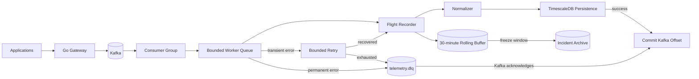

# TelemetryForge

**Distributed, event-driven telemetry control plane and observability gateway.**

TelemetryForge sits between applications and observability backends. The
repository is intentionally built as a readable engineering record: source code
documents non-obvious decisions, while Markdown explains architecture,
reliability behavior, trade-offs, and operations in plain language.

> **Current release: v0.5.0 — Reliability, DLQ & Incident Flight Recorder**

## What v0.5.0 adds

v0.4.0 made telemetry durable. v0.5.0 makes failures explicit and recoverable:

- transient vs permanent failure classification
- bounded exponential retry with jitter
- four-attempt default retry ceiling
- Kafka dead-letter topic `telemetry.dlq`
- source topic/partition/offset preserved in DLQ records
- malformed Kafka payload preservation
- source offset committed only after DLQ acknowledgement
- first `telemetryctl` operations CLI
- DLQ replay from exported dead-letter records
- deduplication pruning lifecycle
- rolling 30-minute Incident Flight Recorder
- incident freeze into durable storage
- idempotent database migration service for upgrades
- tests for retry and failure-routing behavior
- human-readable reliability documentation and ADRs

## Architecture



## Reliability contract

A successful event follows:

```text
consume
  ↓
flight-record full envelope
  ↓
normalize
  ↓
persist idempotently
  ↓
commit Kafka offset
```

A transient failure follows:

```text
failure
  ↓
retry with exponential backoff + jitter
  ↓
up to four total attempts
  ↓
success OR DLQ
```

A terminal failure follows:

```text
permanent/exhausted failure
  ↓
publish detailed DLQ record
  ↓
wait for Kafka acknowledgement
  ↓
commit original source offset
```

If the DLQ publish fails, the source record remains uncommitted.

## Quickstart

```bash
docker compose up --build
```

This starts:

- PostgreSQL/TimescaleDB
- idempotent database migrations
- Apache Kafka
- topic initialization including `telemetry.dlq`
- ingestion/query gateway
- processing worker

Submit a metric:

```bash
curl -X POST http://localhost:8080/api/v1/metrics \
  -H "Content-Type: application/json" \
  -d '{
    "source":"payment-service",
    "type":"request.duration",
    "timestamp":"2026-09-09T15:30:00Z",
    "tags":{"environment":"production","region":"us-west"},
    "value":147.2,
    "unit":"ms",
    "schema_version":"1.0",
    "correlation_id":"order-123"
  }'
```

Query persisted metrics:

```bash
curl "http://localhost:8080/api/v1/metrics?source=payment-service&limit=25"
```

## Incident Flight Recorder

Every decoded Kafka event is copied into a short-lived, full-fidelity rolling
buffer **before normalization**.

Default development retention:

```text
30 minutes
```

Freeze a useful incident window before it rolls away:

```bash
go run ./cmd/telemetryctl incident freeze \
  --id INC-2026-0042 \
  --title "Checkout latency spike" \
  --from 2026-09-09T16:00:00Z \
  --to 2026-09-09T16:20:00Z
```

The selected telemetry is copied into durable incident storage.

This is the first implementation of TelemetryForge's "black box recorder"
concept and the foundation for later incident replay and Evidence Graph work.

## Dead-letter queue

Terminal failures are written to:

```text
telemetry.dlq
```

DLQ envelopes preserve:

```text
decoded event (when available)
malformed raw bytes (base64 when needed)
original Kafka topic
partition
offset
failure classification
error message
attempt count
failure timestamp
```

That metadata makes the DLQ an investigation/replay source rather than merely a
trash topic.

### Replay

After exporting a DLQ JSON record:

```bash
go run ./cmd/telemetryctl dlq replay \
  --file dead-letter.json
```

The event is republished to its original topic unless `--topic` is supplied.

Malformed raw payloads are intentionally not automatically replayed.

## Deduplication lifecycle

v0.4.0 introduced event-ID idempotency. v0.5.0 introduces an explicit lifecycle
for those reservations:

```bash
go run ./cmd/telemetryctl dedup prune
```

The default removes IDs older than 35 days. The CLI refuses horizons shorter
than 30 days in this release because raw telemetry itself defaults to 30-day
retention.

See `docs/reliability/dedup-lifecycle.md` before changing this policy.

## Database migrations

A dedicated `db-migrate` Compose service applies every migration on startup.

This is deliberately separate from PostgreSQL's
`docker-entrypoint-initdb.d`, which only runs against an empty data directory.
As a result, a local v0.4.0 volume can be upgraded to the v0.5.0 schema instead
of silently missing new tables.

Migration SQL remains idempotent and human-readable.

## Human-readable documentation

Recommended v0.5.0 reading:

```text
docs/reliability/retries.md
docs/reliability/dlq.md
docs/reliability/flight-recorder.md
docs/reliability/dedup-lifecycle.md

docs/adr/0009-classified-retries-and-dlq.md
docs/adr/0010-flight-recorder-buffer.md
```

Existing architecture/storage documentation is retained and updated as the
system evolves.

## Repository layout

```text
cmd/gateway/              HTTP ingestion and query service
cmd/worker/               Kafka processing service
cmd/telemetryctl/         operations / replay CLI

internal/api/             HTTP transport
internal/domain/          canonical events + DLQ envelope
internal/stream/          Kafka producer / consumer
internal/worker/          processing, retry, Flight Recorder
internal/reliability/     failure classification + backoff
internal/storage/         PostgreSQL / TimescaleDB
migrations/               idempotent database migrations

docs/architecture/        system behavior
docs/storage/             data design
docs/reliability/         failure and incident behavior
docs/adr/                 engineering decisions
```

## Signature direction

TelemetryForge is deliberately building toward features that are more useful
than another generic metrics dashboard:

- **Incident Flight Recorder** — foundation now implemented
- **Incident Replay**
- **Cardinality Firewall**
- **Telemetry Cost Simulator**
- **Evidence Graph**

## Roadmap

| Version | Milestone |
|---|---|
| **0.1.0** | Foundation and ingestion API |
| **0.2.0** | Kafka durable publishing |
| **0.3.0** | Consumer groups, workers, backpressure |
| **0.4.0** | PostgreSQL/TimescaleDB persistence |
| **0.5.0** | **Retries, DLQ, replay tooling, Flight Recorder foundation** |
| **0.6.0** | Real-time dashboard and automatic incident capture |
| **0.7.0** | Kubernetes scaling and Cardinality Firewall |
| **0.8.0** | Terraform, policy-as-code, shadow pipeline |
| **0.9.0** | Incident Replay, cost simulation, observability/load testing |
| **1.0.0** | Evidence Graph and production-grade portfolio release |

## Security status

v0.5.0 is still a development release. Authentication, tenant isolation,
Kafka TLS/SASL, rate limiting, authorization, and PII redaction are not yet
implemented. DLQ and Flight Recorder data can contain the same sensitive
payloads as original telemetry.

Do not expose this release directly to untrusted networks.

## License

MIT
