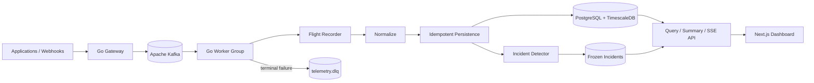

# TelemetryForge

[](https://github.com/fuhrdan/TelemetryForge/actions/workflows/ci.yml)
[](https://go.dev/)
[](https://nextjs.org/)
[](LICENSE)

**Distributed, event-driven telemetry control plane and observability gateway.**

TelemetryForge accepts telemetry, buffers it durably through Kafka, processes it
with bounded Go workers, persists it in PostgreSQL/TimescaleDB, preserves
full-fidelity incident evidence, and exposes live operations data through a
Next.js dashboard.

The project is deliberately built as an engineering portfolio as well as a
working system: important behavior is tested, non-obvious code is commented,
and architecture decisions are documented in plain English.

> **Stable release:** `v0.6.0` — Real-Time Dashboard & Automatic Incident Capture<br>
> **Development target:** `v0.7.0` — Kubernetes Scaling & Cardinality Firewall

## Why TelemetryForge is different

Many observability platforms already collect logs, metrics, and traces.
TelemetryForge is focused on the **control plane between applications and those
backends**.

Current and planned differentiators include:

- **Incident Flight Recorder** — keep a short full-fidelity rolling buffer even
  when normal storage/policy becomes selective.
- **Automatic Incident Capture** — freeze evidence before the rolling buffer
  expires when deterministic latency/error thresholds trip.
- **Cardinality Firewall** — v0.7.0 target: detect dangerous dimensions before
  they create an observability-cost explosion downstream.
- **Incident Replay** — safely replay captured production evidence through new
  policies and processors.
- **Telemetry Cost Simulator** — show the storage/cost effect and visibility
  trade-off before changing telemetry policy.
- **Evidence Graph** — connect incident conclusions to supporting and
  contradicting telemetry instead of producing opaque diagnoses.

See the [roadmap](ROADMAP.md) for the planned sequence.

## Architecture



For the system guarantees and component boundaries, read
[ARCHITECTURE.md](ARCHITECTURE.md).

## Current capabilities

| Area | Current behavior |
|---|---|
| Ingestion | Go HTTP API with versioned canonical event envelope |
| Durable handoff | Kafka with broker acknowledgement before HTTP `202` |
| Partitioning | Stable source key for per-source ordering |
| Processing | Consumer groups, bounded worker queue, backpressure |
| Delivery | At-least-once processing with contiguous per-partition commits and rebalance-safe poll batches |
| Reliability | Classified retry, exponential backoff/jitter, DLQ |
| Persistence | PostgreSQL + TimescaleDB with idempotent event IDs |
| Incident evidence | 30-minute full-fidelity rolling Flight Recorder |
| Incident capture | Manual and automatic latency/error threshold freezing |
| Live UI | Next.js dashboard with SSE, summaries, incident timeline |
| Operations | `telemetryctl` freeze/replay/dedup commands |

## Quickstart

### Requirements

- Docker with Docker Compose
- Optional for direct development: Go 1.27.1+ and Node.js 24.21 LTS

Start the complete local stack:

```bash
docker compose up --build
```

Open the dashboard:

```text
http://localhost:3000
```

Gateway/API:

```text
http://localhost:8080
```

Generate normal demo traffic:

```bash
make demo-traffic
```

Generate traffic that deliberately crosses the automatic incident thresholds:

```bash
make demo-incident
```

The second command is useful for a fast portfolio demo: live telemetry appears
in the dashboard, the latency/error thresholds trip, and the Flight Recorder
freezes an incident window for investigation.

## Example ingestion

```bash
curl -X POST http://localhost:8080/api/v1/metrics \
  -H "Content-Type: application/json" \
  -d '{
    "source":"payment-service",
    "type":"request.duration",
    "timestamp":"2026-09-09T15:30:00Z",
    "tags":{"environment":"demo","region":"local"},
    "value":147.2,
    "unit":"ms",
    "schema_version":"1.0",
    "correlation_id":"order-123"
  }'
```

Query persisted metrics:

```bash
curl "http://localhost:8080/api/v1/metrics?source=payment-service&limit=25"
```

Dashboard summary:

```bash
curl "http://localhost:8080/api/v1/dashboard/summary?window=5m"
```

## Reliability model

TelemetryForge makes failure ordering explicit.

Successful processing:

```text
Kafka record
    -> Flight Recorder
    -> normalize
    -> idempotent database transaction
    -> automatic incident evaluation
    -> commit Kafka offset
```

Terminal failure:

```text
processing failure
    -> classified retry when transient
    -> telemetry.dlq when permanent/exhausted
    -> wait for DLQ acknowledgement
    -> commit original source offset
```

Concurrent workers do not commit offsets independently. TelemetryForge
advances each Kafka partition only through the contiguous completed prefix and
holds the consumer-group rebalance gate until the bounded poll batch has
finished.

The project intentionally claims **at-least-once**, not exactly-once,
processing. Database event IDs provide idempotency at the current persistence
boundary.

## Documentation

The complete documentation map is in [`docs/README.md`](docs/README.md).

Useful starting points:

- [Architecture overview](docs/architecture/overview.md)
- [Event flow](docs/architecture/event-flow.md)
- [HTTP API reference](docs/api/http-api.md)
- [Configuration reference](docs/reference/configuration.md)
- [Failure handling](docs/architecture/failure-handling.md)
- [Incident Flight Recorder](docs/reliability/flight-recorder.md)
- [Automatic incident capture](docs/incidents/automatic-capture.md)
- [SSE design](docs/dashboard/sse.md)
- [Troubleshooting](docs/operations/troubleshooting.md)
- [Testing strategy](docs/development/testing.md)
- [v0.7.0 plan](docs/roadmap/v0.7.0.md)

Architectural decisions are captured in [`docs/adr/`](docs/adr/).

## Repository layout

```text
cmd/gateway/                 Go ingestion/query/SSE service
cmd/worker/                  Go Kafka processing service
cmd/telemetryctl/            operations and replay CLI

dashboard/                   Next.js / React / TypeScript dashboard

internal/api/                HTTP and SSE transport
internal/domain/             canonical event + DLQ envelopes
internal/incident/           automatic incident detection
internal/reliability/        retry/error classification
internal/storage/            PostgreSQL/TimescaleDB repository
internal/stream/             Kafka producer/consumer boundary
internal/worker/             bounded processing pipeline

migrations/                  idempotent SQL migrations
scripts/                     demo and repository checks
tests/integration/           external dependency integration tests

docs/                       architecture, operations, reliability, ADRs
.github/                     CI, Dependabot, issue/PR templates
```

## Development

Fast backend checks:

```bash
make check
```

Documentation/repository hygiene:

```bash
make docs-check
```

Dashboard build/type check:

```bash
make dashboard-build
```

External integration tests require Kafka and TimescaleDB:

```bash
make integration-test
```

See [CONTRIBUTING.md](CONTRIBUTING.md) for the full development workflow.

## Technology baseline

The v0.7.0 development branch refreshes the runtime/tooling baseline while
keeping feature behavior at the stable v0.6.0 level until v0.7 capabilities are
implemented:

- Go 1.27.1
- Apache Kafka 4.3.1
- TimescaleDB 2.30.0 / PostgreSQL 17 image
- Node.js 24.21.0 LTS
- Next.js 16.3.4
- React / React DOM 19.2.8
- TypeScript 5.9.3
- Alpine Linux 3.24.1 runtime

See [the version baseline](docs/reference/versions.md) for the dependency policy.

## Security status

TelemetryForge is still pre-1.0. The local stack does **not** yet implement the
complete authentication, tenant-isolation, Kafka TLS/SASL, secret-management,
and PII-redaction model required for Internet-facing production use.

Do not expose the development Compose stack directly to an untrusted network.
See [SECURITY.md](SECURITY.md).

## Project status and performance claims

The repository distinguishes released capabilities from planned work. v0.7.0
items remain marked **in development** until their acceptance criteria pass.

No throughput/latency benchmark is claimed in this README yet. Reproducible k6
load testing and checked-in performance methodology are planned before v1.0.

## License

[MIT](LICENSE)
