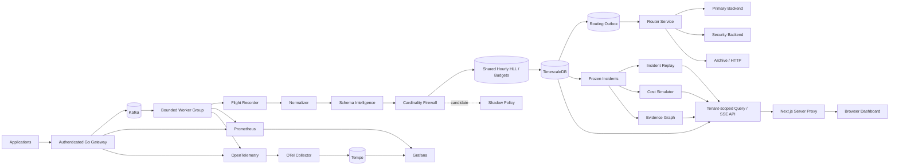

# TelemetryForge

[](https://github.com/fuhrdan/TelemetryForge/actions/workflows/ci.yml)
[](https://go.dev/)
[](https://kubernetes.io/)
[](https://www.terraform.io/)
[](https://opentelemetry.io/)
[](LICENSE)

**OpenTelemetry-native telemetry control plane for incident evidence, policy
safety, cardinality control, and replayable investigations.**

> **Current development release:** `v1.4.0` — Adaptive Sampling & Telemetry Shaping,
> protected incident/error signals, queue-pressure adaptation, deterministic
> sampling, transformations, shadow preview, and visibility-retention evidence.

TelemetryForge sits between applications and observability backends. It does
not try to replace Grafana, Datadog, Splunk, Honeycomb, or another visualization
backend. It controls telemetry **before** downstream cost, cardinality, policy,
and evidence decisions become irreversible.

## Signature capabilities

### Incident Flight Recorder

Keeps a rolling full-fidelity pre-policy telemetry buffer and freezes incident
windows before retention removes them.

### Schema Intelligence

Learns the actual tenant/source/type schema seen in production telemetry and
tracks declared `schema_version` history without turning every sparse field into
a false alarm.

It detects:

- additive fields;
- same-version JSON type changes;
- disappearance of established required fields;
- declared-version compatibility changes;
- legacy OpenTelemetry semantic attributes; and
- unexpected `schema_url` changes.

Schema observation runs after normalization and before policy mutation, and is
**fail-open by default** so registry problems do not become ingestion outages.

Read [Schema Intelligence](docs/schema/schema-intelligence.md).

### Distributed Cardinality Firewall

Production workers now merge tenant-aware cardinality state through
TimescaleDB/PostgreSQL rather than making replica-local decisions.

Each hourly state keeps only:

- 64 HLL registers;
- the first 16 SHA-256-derived unique hashes; and
- bounded timing/sample metadata.

Policy actions remain explicit:

```text
allow
drop_tag
quarantine
```

Versioned policy can also define **hourly unique-series budgets**. Budgets expose
`healthy`, `warning`, `critical`, and `exceeded` pressure but never silently
drop telemetry.

Read:

- [Distributed Cardinality Intelligence](docs/cardinality/distributed-cardinality.md)
- [Cardinality Budgets](docs/cardinality/budgets.md)

### Telemetry Router

Routes the post-policy canonical event to multiple independent backends without
putting external destination I/O inside the primary Kafka worker.

Routing can match authenticated tenant, source, event type, severity, and tag
patterns. Matching rules fan out to a deduplicated destination set.

v1.3.0 includes:

- Kafka destinations;
- HTTP/webhook destinations;
- unmatched-event fallback;
- per-destination bounded retry;
- per-destination DLQ;
- terminal failure fallback;
- multi-replica leased outbox dispatch; and
- candidate shadow routing that never performs candidate I/O.

Read:

- [Telemetry Router](docs/routing/telemetry-router.md)
- [Shadow Routing](docs/routing/shadow-routing.md)

### Adaptive Sampling & Telemetry Shaping

The worker can now reduce healthy high-volume telemetry **after** full-fidelity
Flight Recorder/schema capture **and after the Cardinality Firewall has observed
the full stream**, but before normal persistence and routing.

Sampling is deterministic from event/config identity and can adapt to bounded
worker queue pressure. The checked-in policy protects errors, severe events,
audit/deployment/security events, high-latency signals, and incident-tagged
telemetry. Protected events also preserve tags/payload unless a reviewed rule
explicitly opts into `shape_protected`.

Shaping rules can also drop/rename tags and safely remove oversized payloads.
A candidate shadow configuration is evaluated without mutating the active path.
A compact retry-stable decision ledger ensures downstream retries cannot change
an already-recorded pressure decision or double-count shaping statistics.

Historical incident preview reports event retention, byte retention, protected
retention, and source/type coverage instead of inventing one opaque visibility
score.

Read:

- [Adaptive Sampling](docs/shaping/adaptive-sampling.md)
- [Shaping Policy](docs/shaping/shaping-policy.md)
- [Visibility Preview](docs/shaping/visibility-preview.md)

### Policy-as-Code + Shadow Pipeline

Versioned JSON policy is validated at startup and in CI.

A candidate shadow policy sees real traffic but never mutates the active event
path.

### Incident Replay

Frozen production evidence can be re-evaluated through current/candidate policy
without re-entering the normal production persistence path.

Optional publication is restricted to:

```text
telemetry.replay
telemetry.replay.*
```

### Telemetry Cost Simulator

Compares baseline/active/shadow canonical bytes and exact sample-series shape.

Dollar projections appear only when an operator explicitly provides a reviewed
pricing model.

## Distributed Cardinality Intelligence

Production cardinality state is keyed by:

```text
tenant / active-shadow mode / source / event type / dimension / hour
```

Worker replicas atomically merge HLL registers in PostgreSQL/TimescaleDB. This
means a stream split across Kafka partitions sees the same shared estimate
instead of one partial count per worker.

Current state:

```text
GET /api/v1/cardinality/state?mode=active
```

Budget status:

```text
GET /api/v1/cardinality/budgets
```

Replay and cost simulation intentionally keep isolated local hourly trackers so
historical analysis cannot change production policy state.

## Evidence Graph

Builds explainable incident relationships from captured evidence:

- shared correlation ID;
- shared trace ID;
- source/time sequence;
- latency-before-error;
- deployment/change-before-error;
- recovery evidence;
- replay/cost-analysis artifacts.

Edges are explicitly classified as:

```text
supporting
contradicting
related
```

TelemetryForge **does not claim temporal association proves root cause**.

## v1 security boundary

Production-oriented v1 adds:

- API-key authentication using hash-only server configuration;
- `ingest`, `read`, and `admin` scopes;
- tenant identity derived from authentication, never trusted from client input;
- tenant-scoped persistence, deduplication, incidents, policy state, replay,
  cost simulation, and Evidence Graphs;
- server-side Next.js dashboard credential proxy;
- presentation-time tag/payload redaction;
- Kafka TLS, optional mTLS, SASL PLAIN and SCRAM;
- authenticated `/metrics` in production auth mode;
- non-root/seccomp Kubernetes defaults and a production Kustomize overlay.

Read:

- [Authentication](docs/security/authentication.md)
- [Tenant Isolation](docs/security/tenant-isolation.md)
- [API Redaction](docs/security/redaction.md)
- [Dashboard Proxy](docs/security/dashboard-proxy.md)
- [Production Profile](docs/deployment/production-profile.md)

## Architecture



See [ARCHITECTURE.md](ARCHITECTURE.md).

## Quickstart

Local development intentionally keeps authentication disabled.

```bash
docker compose up --build
```

Open:

```text
TelemetryForge: http://localhost:3000
Gateway:        http://localhost:8080
Router admin:   http://localhost:8082
Grafana:        http://localhost:3001
Prometheus:     http://localhost:9090
Tempo:          http://localhost:3200
```

Generate normal telemetry:

```bash
make demo-traffic
```

Generate the v1 investigation scenario:

```bash
make demo-evidence
```

The evidence scenario emits:

```text
deployment marker
   -> high latency
   -> errors
   -> recovery
```

Select the automatic incident in the dashboard to inspect the Evidence Graph.

Exercise v1.1 schema drift separately:

```bash
make demo-schema
```

That demo establishes `orders-api / order.created` v1, introduces a missing
required field and type conflict without changing the version, then emits a
breaking v2 declaration. Refresh the dashboard and inspect **Schema
Intelligence**.

Exercise distributed cardinality with the existing high-cardinality generator:

```bash
make demo-cardinality
```

Then inspect **Distributed Cardinality** and **Series Budgets** in the dashboard
or run:

```bash
go run ./cmd/telemetryctl cardinality top --mode active --tenant default
go run ./cmd/telemetryctl cardinality budgets --tenant default
```

See [v1 Portfolio Demo](docs/demo/v1-portfolio-demo.md) and
[Schema Intelligence](docs/schema/schema-intelligence.md).

Validate and inspect v1.3 routing:

```bash
go run ./cmd/telemetryctl routing validate --file routing/active.json
go run ./cmd/telemetryctl routing destinations --tenant default
go run ./cmd/telemetryctl routing deliveries --status retry --tenant default
go run ./cmd/telemetryctl routing dlq list --tenant default
```

The local active configuration routes unmatched events to `primary`, fans
production errors to `primary + security`, and uses `archive` as a terminal
failure fallback.

## Authentication

Production mode:

```text
TELEMETRYFORGE_AUTH_MODE=api_key
TELEMETRYFORGE_API_KEYS_FILE=/run/secrets/api-keys.json
```

Example API-key document:

```json
{
  "keys": [
    {
      "name": "checkout-ingest",
      "sha256": "<sha256-of-raw-key>",
      "tenant_id": "acme",
      "scopes": ["ingest"]
    }
  ]
}
```

Clients **must omit** `tenant_id` from the event envelope. The gateway assigns
tenant identity from the authenticated key.

## Schema Intelligence

Inspect what one producer has actually emitted:

```bash
go run ./cmd/telemetryctl schema inspect \
  --source orders-api \
  --type order.created \
  --tenant default
```

Compare two declared versions:

```bash
go run ./cmd/telemetryctl schema diff \
  --source orders-api \
  --type order.created \
  --from 1.0 \
  --to 2.0 \
  --tenant default
```

The canonical envelope now accepts optional OpenTelemetry `schema_url` in
addition to the required application `schema_version`.

## Evidence Graph

API:

```text
GET /api/v1/incidents/{id}/evidence-graph
```

CLI:

```bash
go run ./cmd/telemetryctl incident graph \
  --id <INCIDENT_ID> \
  --tenant default
```

The graph stores its relationship basis and contradictory evidence rather than
reducing the incident to a single unsupported "root cause."

## Replay and cost analysis

```bash
go run ./cmd/telemetryctl incident replay \
  --id <INCIDENT_ID> \
  --tenant default

go run ./cmd/telemetryctl cost simulate \
  --incident <INCIDENT_ID> \
  --tenant default
```

## Self-observability

Gateway:

```text
GET :8080/metrics
```

Worker:

```text
GET :8081/metrics
```

Router:

```text
GET :8082/metrics
```

In `api_key` mode `/metrics` requires an `admin` credential.

Kafka lag is broker-derived from committed group offsets versus broker end
offsets.

OpenTelemetry Trace Context propagates through Kafka headers, connecting:

```text
HTTP request -> Kafka publish -> worker.process -> worker.stage
```

## Production Kubernetes profile

Base:

```bash
kubectl kustomize deployments/kubernetes/base
```

Production overlay:

```bash
kubectl kustomize deployments/kubernetes/overlays/production
```

The overlay turns on:

- API-key auth
- payload redaction
- Kafka TLS/SCRAM
- secret-mounted API-key hashes
- server-side dashboard read credential
- authenticated metrics model

See [Production Profile](docs/deployment/production-profile.md).

## Terraform

AWS EKS foundation:

```text
infra/terraform/aws/
```

Current project baseline:

```text
Terraform 1.16.2
AWS provider 6.62.0
EKS Kubernetes 1.36
```

## k6 methodology

```bash
make load-smoke
make load-sustained
make load-backpressure
```

TelemetryForge intentionally does not publish a universal throughput number
without a checked-in environment/result artifact.

See [Benchmark Methodology](docs/performance/benchmark-methodology.md).

## Operations

Upgrade:

[Upgrade to v1.0.0](docs/operations/upgrade-v1.md)

Rollback:

[v1.0.0 Rollback Runbook](docs/operations/rollback-v1.md)

CLI:

[telemetryctl](docs/operations/telemetryctl.md)

## Repository layout

```text
cmd/                         gateway, worker, router, telemetryctl
dashboard/                   Next.js dashboard + server-side API proxy
internal/api/                REST + SSE
internal/costsim/            Telemetry Cost Simulator
internal/domain/             canonical tenant-aware envelope
internal/evidence/           Evidence Graph
internal/health/             worker health/readiness
internal/incident/           automatic incident detection
internal/observability/      Prometheus/OpenTelemetry
internal/policy/             Cardinality Firewall, budgets + shadow policy
internal/reliability/        retries/error classification
internal/replay/             isolated Incident Replay
internal/router/             routing policy + destination dispatcher
internal/security/           auth, tenant context, redaction
internal/schema/             schema derivation, semantic conventions, diffs
internal/storage/            PostgreSQL/TimescaleDB + shared cardinality state
internal/stream/             Kafka producer/consumer/TLS/SASL/lag
internal/worker/             bounded processing pipeline

deployments/kubernetes/      base + production overlay
deployments/observability/   Prometheus/Grafana/Tempo/Collector
infra/terraform/aws/         EKS foundation
load/k6/                     reproducible load methodology
migrations/                  schema migrations
policies/                    active/shadow policy-as-code
pricing/                     explicit cost assumptions
routing/                     active/shadow routing policy
security/                    hash-only demo API-key document
docs/                        human-readable engineering docs
```


## Adaptive shaping API

```text
GET /api/v1/shaping/stats?window=1h
GET /api/v1/shaping/shadow-diffs
```

Validate or preview from CLI:

```bash
go run ./cmd/telemetryctl shaping validate --file shaping/active.json
go run ./cmd/telemetryctl shaping preview --incident <INCIDENT_ID> --candidate shaping/shadow.json --pressure 0.9
```

## Security status

The v1 security boundary remains in force in v1.3.0. No repository can make a
deployment "secure" without the environment around it.

Operators remain responsible for:

- HTTPS/ingress TLS;
- broker/database network controls;
- secret-manager policy;
- PostgreSQL backup/access policy;
- Prometheus/Grafana/Tempo authentication;
- tenant-specific legal/PII requirements;
- production key rotation.

See [SECURITY.md](SECURITY.md).

## License

[MIT](LICENSE)
