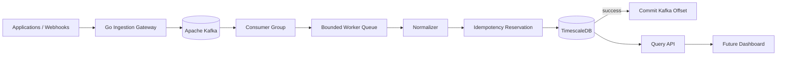

# TelemetryForge

**Distributed, event-driven telemetry control plane and observability gateway.**

TelemetryForge sits between applications and observability backends. Each
release is intentionally documented so a reviewer can understand both the code
and the engineering decisions behind it.

> **Current release: v0.4.0 — Durable Time-Series Persistence**

## What v0.4.0 adds

v0.3.0 introduced Kafka consumer groups and bounded processing. v0.4.0 makes
that pipeline durable:

- PostgreSQL + TimescaleDB storage
- current TimescaleDB `2.30.0-pg17` development image
- pgx v5 PostgreSQL connection pooling
- `telemetry_events` TimescaleDB hypertable
- global event-ID deduplication table
- transactional idempotent writes
- Kafka offsets committed only after durable persistence
- source/type/correlation/time indexes
- JSONB tags and payload storage
- 30-day development retention policy
- bounded query API
- `GET /api/v1/events`
- `GET /api/v1/metrics`
- storage/query/persistence tests and human-readable documentation

## Architecture



The critical v0.4.0 ordering is:

```text
Kafka record
    ↓
normalize
    ↓
reserve event ID
    ↓
write TimescaleDB row
    ↓
commit database transaction
    ↓
commit Kafka offset
```

If database persistence fails, the Kafka record is **not** acknowledged.

## Quickstart

```bash
docker compose up --build
```

This starts:

- Apache Kafka
- TimescaleDB/PostgreSQL
- topic initialization
- the ingestion gateway
- the processing worker

Submit a metric:

```bash
curl -X POST http://localhost:8080/api/v1/metrics \
  -H "Content-Type: application/json" \
  -d '{
    "source":"payment-service",
    "type":"request.duration",
    "timestamp":"2026-09-09T15:30:00Z",
    "tags":{"environment":"production","region":"us-west"},
    "value":147.2,
    "unit":"ms",
    "schema_version":"1.0",
    "correlation_id":"order-123"
  }'
```

Query it after the worker persists it:

```bash
curl "http://localhost:8080/api/v1/metrics?source=payment-service&limit=25"
```

Query events in a time range:

```bash
curl "http://localhost:8080/api/v1/events?from=2026-09-09T00:00:00Z&to=2026-09-10T00:00:00Z"
```

## Why the separate deduplication table?

TelemetryForge uses at-least-once Kafka processing, so duplicates are possible
after a crash or rebalance.

TimescaleDB hypertable uniqueness rules require the partition timestamp to be
part of a unique key. That does not provide the global event-ID guarantee we
want.

v0.4.0 therefore uses:

```text
event_dedup
    event_id PRIMARY KEY

telemetry_events
    TimescaleDB hypertable by event_time
```

Both writes occur in the same transaction. A duplicate event ID becomes a safe
no-op instead of another telemetry row.

See `docs/storage/schema.md` and ADR 0008 for the full reasoning.

## Query API

### Events

```text
GET /api/v1/events
```

### Metrics

```text
GET /api/v1/metrics
```

Filters:

| Parameter | Meaning |
|---|---|
| `source` | Exact telemetry source |
| `type` | Exact event type |
| `from` | RFC3339 inclusive start |
| `to` | RFC3339 inclusive end |
| `limit` | 1–1000, default 100 |

Results are newest first.

## Storage schema

`telemetry_events` stores the canonical event envelope:

```text
event_id
source
event_type
event_time
tags JSONB
payload JSONB
metric_value
metric_unit
schema_version
correlation_id
ingested_at
```

Indexes cover the first expected analytics paths:

- source + time
- event type + time
- correlation ID + time
- GIN tags lookup

The migration also installs a 30-day development retention policy.

## Human-readable documentation

The project continues to document *why* behavior exists, not just what a
function is called.

Recommended v0.4.0 reading:

```text
docs/storage/schema.md
docs/storage/retention.md
docs/storage/querying.md
docs/architecture/worker-model.md
docs/architecture/backpressure.md
docs/architecture/failure-handling.md
docs/adr/0007-timescaledb-storage.md
docs/adr/0008-idempotent-event-storage.md
```

Public Go types have GoDoc comments. Concurrency, transaction, idempotency, and
failure-ordering code contains explanatory comments where the reason is not
obvious.

## Repository layout

```text
cmd/gateway/              ingestion + query API executable
cmd/worker/               Kafka processing executable

internal/api/             HTTP ingestion/query transport
internal/domain/          canonical telemetry envelope
internal/stream/          Kafka producer and consumer
internal/worker/          bounded processing pipeline
internal/storage/         PostgreSQL/TimescaleDB repository

migrations/               database schema
docs/architecture/        system behavior
docs/storage/             human-readable data design
docs/adr/                 architecture decision records
tests/integration/        external-dependency tests
```

## Signature direction

The architecture is deliberately building toward:

- **Incident Flight Recorder**
- **Incident Replay**
- **Cardinality Firewall**
- **Telemetry Cost Simulator**
- **Evidence Graph**

Durable raw telemetry is the foundation needed for incident capture and replay.

## Roadmap

| Version | Milestone |
|---|---|
| **0.1.0** | Foundation and ingestion API |
| **0.2.0** | Kafka durable publishing |
| **0.3.0** | Consumer groups, workers, backpressure |
| **0.4.0** | **PostgreSQL/TimescaleDB persistence and query API** |
| **0.5.0** | Reliability, DLQ, idempotency tooling, Flight Recorder foundation |
| **0.6.0** | Real-time dashboard and incident capture |
| **0.7.0** | Kubernetes scaling and Cardinality Firewall |
| **0.8.0** | Terraform, policy-as-code, shadow pipeline |
| **0.9.0** | Incident Replay, cost simulation, observability/load testing |
| **1.0.0** | Evidence Graph and production-grade portfolio release |

## Security status

v0.4.0 is still a development release. Authentication, tenant isolation,
Kafka TLS/SASL, rate limiting, and authorization are not yet implemented.
Do not expose it directly to untrusted networks.

## License

MIT
