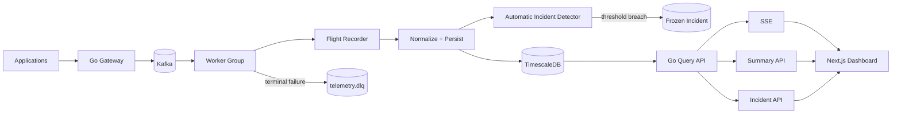

# TelemetryForge

**Distributed, event-driven telemetry control plane and observability gateway.**

TelemetryForge sits between applications and observability backends. The repo
is built as a readable engineering record: source comments explain non-obvious
behavior, Markdown documents architecture and trade-offs, and each tagged
release adds one coherent capability layer.

> **Current release: v0.6.0 — Real-Time Dashboard & Automatic Incident Capture**

## What v0.6.0 adds

v0.5.0 introduced reliability and the Incident Flight Recorder. v0.6.0 makes
the system visible and starts using that recorder automatically:

- Next.js 16.3.4 + TypeScript dashboard
- React 19.2.7
- responsive dark operations UI
- SSE live telemetry stream
- five-minute operational summary
- events/sec, error rate, P95 latency, active-source cards
- dependency-light SVG live metric chart
- incident list and captured-event timeline
- automatic high-latency incident freezing
- automatic error-burst incident freezing
- 10-minute incident cooldown
- configurable latency/error thresholds
- incident trigger metadata
- durable-store-backed live streaming
- same-origin dashboard API proxy
- dashboard container and Compose service
- new API routes for summary, incidents, incident events, and SSE
- human-readable dashboard/SSE/automatic-capture documentation

## Architecture



## Quickstart

```bash
docker compose up --build
```

Then open:

```text
http://localhost:3000
```

The gateway remains available at:

```text
http://localhost:8080
```

Generate healthy demo traffic:

```bash
make demo-traffic
```

Deliberately cross the latency/error thresholds and demonstrate automatic
Flight Recorder freezing:

```bash
make demo-incident
```

Compose starts:

- TimescaleDB/PostgreSQL
- idempotent database migrations
- Kafka
- Kafka topic initialization
- Go ingestion/query gateway
- Go processing worker
- Next.js dashboard

## Dashboard

The main dashboard shows:

```text
Events/sec | Error rate | P95 latency | Active sources
-------------------------------------------------------
Live metric signal        | Frozen incidents
-------------------------------------------------------
Live SSE telemetry        | Incident investigation
```

No chart library is required in v0.6.0. The first live chart is a small React
SVG component, keeping the frontend dependency surface intentionally narrow.

## Live telemetry

The browser connects to:

```text
GET /api/v1/live
```

through a same-origin Next.js rewrite.

SSE events look like:

```text
event: telemetry
id: 32ee8f...
data: {"id":"32ee8f...","source":"checkout", ...}
```

The Go endpoint polls the durable store once per second rather than broadcasting
from gateway memory. That design is intentionally compatible with multiple
gateway/worker replicas.

See:

```text
docs/dashboard/sse.md
docs/adr/0011-sse-from-durable-store.md
```

## Automatic incident capture

v0.6.0 watches successfully persisted telemetry for two simple, explainable
conditions.

### High latency

Default:

```text
request.duration / latency metric >= 1000 ms
```

### Error burst

Default:

```text
5 errors from one source inside 1 minute
```

On a trigger, TelemetryForge freezes the previous 15 minutes from the Flight
Recorder into a durable incident.

A 10-minute source/reason cooldown avoids creating an incident for every sample
during the same outage.

Configure the two public thresholds with:

```text
TELEMETRYFORGE_INCIDENT_LATENCY_MS=1000
TELEMETRYFORGE_INCIDENT_ERROR_COUNT=5
```

These deterministic rules are deliberate. Source-specific policy-as-code comes
later; v0.6.0 avoids pretending an opaque anomaly model is correct before we
have baseline data.

## Incident investigation

The dashboard reads:

```text
GET /api/v1/incidents
GET /api/v1/incidents/{id}/events
```

Selecting an incident shows:

- incident ID
- trigger reason
- captured event count
- chronological event timeline
- source/type for captured telemetry

This is the first UI surface that will later grow into Incident Replay and the
Evidence Graph.

## Dashboard summary API

```text
GET /api/v1/dashboard/summary?window=5m
```

Returns:

```json
{
  "window_seconds": 300,
  "events": 1421,
  "events_per_second": 4.736,
  "error_count": 8,
  "error_rate": 0.0056,
  "p95_latency_ms": 187.4,
  "active_sources": 7
}
```

The summary is calculated from stored telemetry, not fabricated counters inside
the dashboard process.

## Human-readable documentation

New v0.6.0 reading:

```text
docs/dashboard/overview.md
docs/dashboard/sse.md
docs/incidents/automatic-capture.md

docs/adr/0011-sse-from-durable-store.md
docs/adr/0012-automatic-incident-thresholds.md
```

Existing reliability, storage, Kafka, worker, migration, and architecture
documentation remains in the repo.

## Repository layout

```text
cmd/gateway/                Go ingestion/query/SSE service
cmd/worker/                 Go processing service
cmd/telemetryctl/           operations CLI

dashboard/                  Next.js / TypeScript dashboard

internal/api/               REST + SSE endpoints
internal/domain/            canonical telemetry envelopes
internal/incident/          automatic threshold detector
internal/reliability/       retries / classification
internal/storage/           TimescaleDB repository
internal/stream/            Kafka producer / consumer
internal/worker/            bounded processing pipeline

migrations/                 idempotent SQL migrations

docs/dashboard/             dashboard and live-stream design
docs/incidents/             incident behavior
docs/reliability/           retries / DLQ / Flight Recorder
docs/storage/               data model
docs/architecture/          system behavior
docs/adr/                   architecture decisions
```

## Signature direction

The project now contains the first visible pieces of its differentiators:

- **Incident Flight Recorder** — implemented
- **Automatic Incident Capture** — implemented
- **Incident Replay** — upcoming
- **Cardinality Firewall** — upcoming
- **Telemetry Cost Simulator** — upcoming
- **Evidence Graph** — upcoming

## Roadmap

| Version | Milestone |
|---|---|
| **0.1.0** | Foundation and ingestion API |
| **0.2.0** | Kafka durable publishing |
| **0.3.0** | Consumer groups, workers, backpressure |
| **0.4.0** | PostgreSQL/TimescaleDB persistence |
| **0.5.0** | Retries, DLQ, replay tooling, Flight Recorder |
| **0.6.0** | **Real-time dashboard and automatic incident capture** |
| **0.7.0** | Kubernetes scaling and Cardinality Firewall |
| **0.8.0** | Terraform, policy-as-code, shadow pipeline |
| **0.9.0** | Incident Replay, cost simulation, observability/load testing |
| **1.0.0** | Evidence Graph and production-grade portfolio release |

## Security status

v0.6.0 remains a development release. Authentication, tenant isolation,
authorization, Kafka TLS/SASL, PII redaction, and production secrets management
are not implemented.

The dashboard exposes stored telemetry and frozen incident data. Do not expose
this stack directly to an untrusted network.

## License

MIT
