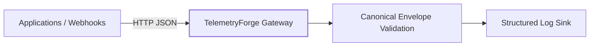

# TelemetryForge

**Distributed, event-driven telemetry control plane and observability gateway.**

TelemetryForge is being built as a horizontally scalable layer between applications and observability backends. The long-term goal is not to replace Datadog, Grafana, Splunk, or similar platforms; it is to make telemetry safer, cheaper, replayable, portable, and easier to reason about before it reaches those systems.

> **Current release: v0.1.0 — Foundation & Ingestion API**

## Why TelemetryForge?

The roadmap centers on five signature capabilities:

- **Incident Flight Recorder** — preserve full-fidelity telemetry surrounding anomalies.
- **Incident Replay** — replay historical production incidents through new rules safely.
- **Cardinality Firewall** — detect dangerous telemetry dimensions before they explode downstream cost.
- **Telemetry Cost Simulator** — estimate cost savings alongside the visibility that a policy would remove.
- **Evidence Graph** — connect incident conclusions to supporting and contradicting telemetry evidence.

v0.1.0 establishes the stable ingestion boundary those capabilities will build on.

## Architecture



The structured log sink is temporary. v0.2.0 introduces Kafka without changing the canonical HTTP event contract.

## API

| Method | Route | Purpose |
|---|---|---|
| GET | `/health` | Liveness probe |
| GET | `/ready` | Readiness probe |
| POST | `/api/v1/events` | Generic telemetry ingestion |
| POST | `/api/v1/metrics` | Numeric metric ingestion |

### Submit a metric

```bash
curl -X POST http://localhost:8080/api/v1/metrics \
  -H "Content-Type: application/json" \
  -d '{
    "source":"payment-service",
    "type":"request.duration",
    "timestamp":"2026-09-09T15:30:00Z",
    "tags":{"environment":"production","region":"us-west"},
    "value":147.2,
    "unit":"ms",
    "schema_version":"1.0",
    "correlation_id":"order-123"
  }'
```

Expected response:

```json
{
  "id": "generated-uuid",
  "status": "accepted"
}
```

## Quickstart

### Go

```bash
go run ./cmd/gateway
```

### Docker

```bash
docker compose up --build
```

Then browse or query:

```text
http://localhost:8080/health
```

## Verify the build

```bash
make check
```

This runs formatting, static analysis, tests, and compilation.

## Repository layout

```text
cmd/gateway/              Gateway executable
internal/api/             HTTP transport
internal/config/          Runtime configuration
internal/domain/          Canonical telemetry model and validation
internal/logging/         Structured logging

docs/architecture/       System design documentation
docs/api/                API and event-contract documentation
docs/adr/                Architecture Decision Records
docs/development/        Developer setup and workflows

deployments/             Container, Kubernetes, and Terraform assets
.github/workflows/        CI/CD automation
```

## Engineering principles

1. **Validate at the edge.** Invalid telemetry should not poison downstream pipelines.
2. **Keep ingestion stateless.** Horizontal scaling must not require shared gateway state.
3. **Version contracts early.** Replay and schema evolution require explicit compatibility boundaries.
4. **Bound resources.** Future queues and worker pools will apply backpressure rather than allowing unbounded memory growth.
5. **Document decisions while building.** Significant choices receive ADRs, tests, and operational documentation in the release where they are introduced.
6. **Evidence over magic.** Future automated incident conclusions must expose the evidence supporting them.

## v0.1.0 scope

Implemented:

- Stateless Go ingestion gateway
- Canonical versioned event envelope
- Strict JSON validation
- 1 MiB request-size limit
- Generated event IDs
- Structured JSON logs
- Health and readiness endpoints
- Graceful shutdown
- Unit/API tests
- Container build
- CI checks
- ADR and developer documentation framework

Intentionally deferred:

- Authentication and tenant isolation
- Kafka
- Persistence
- Retry/DLQ processing
- OpenTelemetry ingestion
- Flight Recorder
- Dashboard
- Kubernetes/Terraform

See `SECURITY.md` before exposing this development release outside a trusted environment.

## Roadmap

| Version | Milestone |
|---|---|
| **0.1.0** | Foundation and ingestion API |
| **0.2.0** | Kafka streaming and durable publishing |
| **0.3.0** | Consumer groups, bounded workers, backpressure |
| **0.4.0** | PostgreSQL / TimescaleDB persistence |
| **0.5.0** | Reliability, DLQ, idempotency, Flight Recorder foundation |
| **0.6.0** | Real-time dashboard and incident capture |
| **0.7.0** | Kubernetes scaling and Cardinality Firewall |
| **0.8.0** | Terraform, policy-as-code, shadow pipeline |
| **0.9.0** | Incident Replay, cost simulation, observability and load testing |
| **1.0.0** | Evidence Graph and production-grade portfolio release |

## Documentation

Start with:

- `docs/architecture/overview.md`
- `docs/api/event-format.md`
- `docs/adr/0001-use-go.md`
- `docs/adr/0002-version-event-envelope.md`
- `docs/development/local-development.md`

## License

MIT
