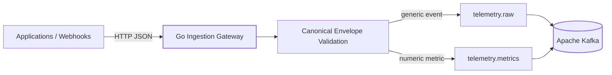

# TelemetryForge

**Distributed, event-driven telemetry control plane and observability gateway.**

TelemetryForge is a horizontally scalable layer between applications and observability backends. Its long-term goal is to make telemetry safer, cheaper, replayable, portable, and easier to reason about before it reaches systems such as Datadog, Grafana, Splunk, or Honeycomb.

> **Current release: v0.2.0 — Kafka Streaming & Durable Publishing**

## Signature direction

The roadmap centers on five differentiating capabilities:

- **Incident Flight Recorder** — preserve full-fidelity telemetry around anomalies.
- **Incident Replay** — replay historical incidents through new rules safely.
- **Cardinality Firewall** — detect dangerous dimensions before they explode downstream cost.
- **Telemetry Cost Simulator** — estimate savings alongside the visibility a policy removes.
- **Evidence Graph** — connect incident conclusions to supporting and contradicting evidence.

v0.2.0 establishes the durable streaming backbone required by those later capabilities.

## Architecture



The next release adds consumer groups and bounded worker pools downstream of Kafka.

## What's new in v0.2.0

- Apache Kafka 4.3.1 local development environment using KRaft
- Kafka-backed Go Publisher abstraction
- Synchronous broker acknowledgement before HTTP 202
- `telemetry.raw` and `telemetry.metrics` topics
- Six partitions per development topic
- Source-keyed partitioning for per-source ordering
- Kafka connectivity integrated into `/ready`
- `503 Service Unavailable` when durable publishing fails
- Event ID, schema version, and correlation ID Kafka headers
- Snappy producer compression
- Environment-driven broker/topic configuration
- Real Kafka integration-test target
- CI job for Kafka integration testing
- ADRs and detailed delivery/partition documentation

## API

| Method | Route | Purpose |
|---|---|---|
| GET | `/health` | Process liveness probe |
| GET | `/ready` | Kafka-aware readiness probe |
| POST | `/api/v1/events` | Generic telemetry ingestion → `telemetry.raw` |
| POST | `/api/v1/metrics` | Numeric metric ingestion → `telemetry.metrics` |

### Submit a metric

```bash
curl -X POST http://localhost:8080/api/v1/metrics \
  -H "Content-Type: application/json" \
  -d '{
    "source":"payment-service",
    "type":"request.duration",
    "timestamp":"2026-09-09T15:30:00Z",
    "tags":{"environment":"production","region":"us-west"},
    "value":147.2,
    "unit":"ms",
    "schema_version":"1.0",
    "correlation_id":"order-123"
  }'
```

A successful `202 Accepted` means the event passed gateway validation **and Kafka acknowledged the produce request**.

## Quickstart

```bash
docker compose up --build
```

Then:

```bash
curl http://localhost:8080/health
curl http://localhost:8080/ready
```

List Kafka topics:

```bash
make kafka-topics
```

## Runtime configuration

| Variable | Default |
|---|---|
| `TELEMETRYFORGE_ADDRESS` | `:8080` |
| `TELEMETRYFORGE_KAFKA_BROKERS` | `localhost:9092` |
| `TELEMETRYFORGE_KAFKA_CLIENT_ID` | `telemetryforge-gateway` |
| `TELEMETRYFORGE_KAFKA_RAW_TOPIC` | `telemetry.raw` |
| `TELEMETRYFORGE_KAFKA_METRIC_TOPIC` | `telemetry.metrics` |

## Verify the build

```bash
make check
```

Run the real Kafka integration test after starting the broker:

```bash
make integration-test
```

## Repository layout

```text
cmd/gateway/              Gateway executable
internal/api/             HTTP transport
internal/config/          Runtime configuration
internal/domain/          Canonical telemetry model
internal/stream/          Kafka / publishing boundary

docs/architecture/       System design
docs/api/                Event/API contract
docs/adr/                Architecture Decision Records
docs/kafka/              Kafka operational/design docs
docs/development/        Local workflows

tests/integration/        Broker-backed integration tests
deployments/              Future container/K8s/Terraform assets
.github/workflows/        CI/CD automation
```

## Engineering principles

1. **Validate at the edge.** Invalid telemetry should not poison downstream pipelines.
2. **Do not lie about durability.** A request is accepted only after the streaming layer acknowledges it.
3. **Keep ingestion stateless.** Horizontal scaling must not require shared gateway memory.
4. **Preserve useful ordering.** Partition by stable producer identity rather than random event ID.
5. **Bound resources.** Future worker queues will apply backpressure rather than growing without limit.
6. **Document decisions while building.** Every architectural milestone includes ADRs and operational documentation.
7. **Evidence over magic.** Future incident conclusions must expose their supporting evidence.

## Roadmap

| Version | Milestone |
|---|---|
| **0.1.0** | Foundation and ingestion API |
| **0.2.0** | **Kafka streaming and durable publishing** |
| **0.3.0** | Consumer groups, bounded workers, backpressure |
| **0.4.0** | PostgreSQL / TimescaleDB persistence |
| **0.5.0** | Reliability, DLQ, idempotency, Flight Recorder foundation |
| **0.6.0** | Real-time dashboard and incident capture |
| **0.7.0** | Kubernetes scaling and Cardinality Firewall |
| **0.8.0** | Terraform, policy-as-code, shadow pipeline |
| **0.9.0** | Incident Replay, cost simulation, observability and load testing |
| **1.0.0** | Evidence Graph and production-grade portfolio release |

## Documentation

Recommended starting points:

- `docs/architecture/overview.md`
- `docs/architecture/event-flow.md`
- `docs/api/event-format.md`
- `docs/kafka/topic-strategy.md`
- `docs/kafka/partitioning.md`
- `docs/kafka/delivery-semantics.md`
- `docs/adr/0003-use-kafka.md`
- `docs/adr/0004-partition-by-source.md`

## Security status

v0.2.0 is still a development release. Authentication, tenant isolation, TLS/SASL Kafka configuration, rate limiting, and authorization are not implemented. Do not expose this release to untrusted networks. See `SECURITY.md`.

## License

MIT
