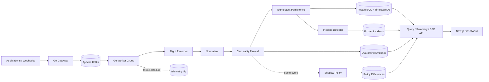

# TelemetryForge

[](https://github.com/fuhrdan/TelemetryForge/actions/workflows/ci.yml)
[](https://go.dev/)
[](https://kubernetes.io/)
[](https://www.terraform.io/)
[](LICENSE)

**Distributed, event-driven telemetry control plane and observability gateway.**

TelemetryForge sits between applications and observability backends. It accepts
telemetry, buffers it durably through Kafka, processes it with bounded Go
workers, persists it in PostgreSQL/TimescaleDB, preserves incident evidence,
protects downstream systems from cardinality explosions, and exposes live
operations data through a Next.js dashboard.

> **Current release:** `v0.8.0` — Kubernetes, Cardinality Firewall, Terraform,
> Policy-as-Code & Shadow Pipeline

## Why TelemetryForge is different

TelemetryForge is not trying to replace every dashboard in Datadog, Grafana,
Splunk, or Honeycomb. It focuses on the **control plane before telemetry reaches
those systems**.

Implemented differentiators now include:

- **Incident Flight Recorder** — rolling full-fidelity evidence before normal
  policy changes telemetry.
- **Automatic Incident Capture** — deterministic latency/error thresholds freeze
  a Flight Recorder window.
- **Cardinality Firewall** — approximate unique-dimension growth is detected
  before identifier-shaped tags become downstream cost explosions.
- **Policy-as-Code** — versioned, strictly validated JSON policy files select
  `allow`, `drop_tag`, or `quarantine`.
- **Shadow Pipeline** — a candidate policy evaluates the same traffic without
  changing the active event path; decision differences are stored and shown in
  the dashboard.

Planned differentiators:

- **Incident Replay**
- **Telemetry Cost Simulator**
- **Evidence Graph**

See [ROADMAP.md](ROADMAP.md).

## v0.8.0 architecture



For reliability and ownership guarantees, read
[ARCHITECTURE.md](ARCHITECTURE.md).

## Current capabilities

| Area | Current behavior |
|---|---|
| Ingestion | Go HTTP API with versioned canonical envelope |
| Durable handoff | Kafka acknowledgement before HTTP `202` |
| Processing | Consumer groups, bounded workers, backpressure |
| Delivery | At-least-once with contiguous per-partition commits and rebalance-safe poll batches |
| Reliability | Classified retries, backoff/jitter, DLQ, idempotent persistence |
| Persistence | PostgreSQL + TimescaleDB |
| Incident evidence | 30-minute full-fidelity Flight Recorder |
| Incident capture | Manual and automatic freezing |
| Cardinality | Bounded 64-register HyperLogLog estimator per source/type/dimension |
| Policy | Active JSON policy + candidate shadow policy |
| Actions | `allow`, `drop_tag`, `quarantine` |
| Live UI | SSE dashboard, incident timeline, firewall findings, shadow diffs |
| Kubernetes | Kustomize base, probes, HPA, PDB, policy ConfigMap |
| Terraform | AWS VPC + EKS foundation |
| Operations | `telemetryctl` incident/DLQ/dedup/policy commands |

## Quickstart

Requirements:

- Docker with Docker Compose
- optional direct development: Go 1.27.1+ and Node.js 24 LTS

Start everything:

```bash
docker compose up --build
```

Open:

```text
Dashboard: http://localhost:3000
Gateway:   http://localhost:8080
```

Generate normal traffic:

```bash
make demo-traffic
```

Trigger automatic incident capture:

```bash
make demo-incident
```

Exercise the Cardinality Firewall and shadow policy:

```bash
make demo-cardinality
```

Then inspect the **Cardinality Firewall** and **Shadow Pipeline** panels in the
dashboard.

## Policy-as-Code

Default active policy:

```text
policies/active.json
```

Candidate shadow policy:

```text
policies/shadow.json
```

Validate either before deployment:

```bash
go run ./cmd/telemetryctl policy validate \
  --file policies/active.json
```

The active policy can remove a dangerous dimension or mark an event quarantined.
The shadow policy **never mutates production behavior**; it only records what it
would have done differently.

Read:

- [Cardinality Firewall](docs/policy/cardinality-firewall.md)
- [Policy-as-Code](docs/policy/policy-as-code.md)
- [Shadow Pipeline](docs/policy/shadow-pipeline.md)

## Cardinality privacy model

The estimator does not keep a set of raw identifier values.

For operational findings, TelemetryForge stores a short SHA-256-derived
fingerprint rather than the original high-cardinality value.

Full original evidence remains only in explicitly protected paths such as the
Flight Recorder/quarantine archive.

## Kubernetes

Render the base:

```bash
kubectl kustomize deployments/kubernetes/base
```

The manifests include:

- gateway, worker, and dashboard deployments
- services
- worker/gateway liveness and dependency-aware readiness
- HPA examples
- PodDisruptionBudgets
- ConfigMaps
- active/shadow policy ConfigMap
- secret template
- ingress example

The worker HPA is intentionally capped at six replicas because the local topic
model uses six partitions. More consumer replicas than partitions do not
increase useful Kafka group concurrency.

See [Kubernetes deployment](docs/deployment/kubernetes.md).

## Terraform

AWS foundation:

```text
infra/terraform/aws/
```

Validate:

```bash
terraform -chdir=infra/terraform/aws init -backend=false
terraform -chdir=infra/terraform/aws validate
```

The module provisions networking and Amazon EKS, while Kafka and
PostgreSQL/TimescaleDB remain external service contracts.

Current cloud baseline:

- Terraform 1.16.1
- AWS provider 6.62.0
- EKS Kubernetes 1.36

Upstream Kubernetes 1.37 is newer, but EKS currently exposes 1.36 as its newest
standard-support minor.

See [Terraform deployment](docs/deployment/terraform.md).

## API additions

Cardinality findings:

```text
GET /api/v1/cardinality/findings?limit=100
```

Shadow-policy differences:

```text
GET /api/v1/policy/shadow-diffs?limit=100
```

The complete API map lives in
[docs/api/http-api.md](docs/api/http-api.md).

## Documentation

Start with [`docs/README.md`](docs/README.md).

Particularly useful for v0.8.0:

- [Architecture overview](docs/architecture/overview.md)
- [Kafka delivery semantics](docs/kafka/delivery-semantics.md)
- [Cardinality Firewall](docs/policy/cardinality-firewall.md)
- [Policy-as-Code](docs/policy/policy-as-code.md)
- [Shadow Pipeline](docs/policy/shadow-pipeline.md)
- [Kubernetes deployment](docs/deployment/kubernetes.md)
- [Terraform deployment](docs/deployment/terraform.md)
- [Configuration reference](docs/reference/configuration.md)
- [Testing strategy](docs/development/testing.md)
- [Troubleshooting](docs/operations/troubleshooting.md)

Architecture decisions are under [`docs/adr/`](docs/adr/).

## Repository layout

```text
cmd/                         gateway, worker, telemetryctl
dashboard/                   Next.js operations UI
internal/api/                REST + SSE transport
internal/domain/             canonical telemetry types
internal/health/             worker health/readiness
internal/incident/           automatic incident capture
internal/policy/             Cardinality Firewall + active/shadow policy
internal/reliability/        retry/error classification
internal/storage/            PostgreSQL/TimescaleDB
internal/stream/             Kafka producer/consumer + offset coordination
internal/worker/             bounded processing pipeline

policies/                    active/shadow policy-as-code
migrations/                  idempotent SQL migrations
deployments/kubernetes/      Kubernetes/Kustomize
infra/terraform/aws/         Terraform EKS foundation
scripts/                     demos and repository checks
tests/integration/           broker/database integration tests
docs/                        human-readable engineering documentation
```

## Validation

Backend:

```bash
make check
```

Documentation/repository:

```bash
make docs-check
```

Policy:

```bash
make policy-check
```

Kubernetes:

```bash
make k8s-render
```

Terraform:

```bash
make terraform-check
```

CI runs unit/race/vet/build checks, Kafka/TimescaleDB integration tests,
dashboard build/type checking, policy validation, Kubernetes rendering, Terraform
validation, and container builds.

## Security status

TelemetryForge remains pre-1.0. The Kubernetes/Terraform material does not yet
provide the complete production authentication, tenant isolation, Kafka
TLS/SASL, secret-management, or PII-redaction model.

Do not treat the checked-in local configuration as Internet-ready production
security.

See [SECURITY.md](SECURITY.md).

## Performance claims

No benchmark number is advertised yet. Reproducible k6 methodology and
self-observability are part of the v0.9.0 milestone.

## License

[MIT](LICENSE)
