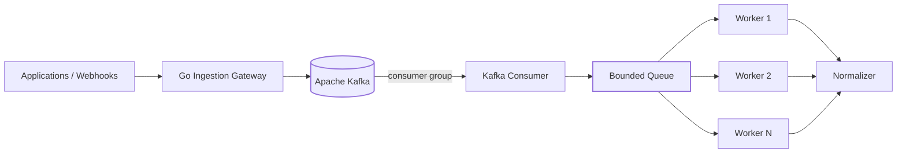

# TelemetryForge

**Distributed, event-driven telemetry control plane and observability gateway.**

TelemetryForge sits between applications and observability backends. The project
is being built in small, documented releases so the repository shows not only
*what* the system does, but *why* each distributed-systems decision was made.

> **Current release: v0.3.0 — Consumer Groups, Worker Pools & Backpressure**

## What v0.3.0 adds

v0.2.0 made Kafka the durable handoff point. v0.3.0 adds the first downstream
processing service:

- Kafka consumer group `telemetryforge-processors`
- separate Go `worker` executable
- bounded worker pool with configurable concurrency
- deliberate backpressure when the worker queue fills
- manual Kafka offset commits after successful processing
- cooperative consumer-group balancing
- normalization stage separated from Kafka transport
- failure logging that leaves failed records uncommitted
- local backlog/lag estimate groundwork
- Docker Compose worker service
- unit tests for processing, acknowledgement, and failure behavior
- human-readable architecture, backpressure, failure, and ADR documentation

## Architecture



The bounded queue is important: if processing becomes slow, TelemetryForge
allows Kafka lag to grow instead of allowing worker memory to grow without
limit.

## Quickstart

```bash
docker compose up --build
```

This starts Kafka, creates the topics, starts the ingestion gateway, and starts
one processing service containing four Go workers.

Check the gateway:

```bash
curl http://localhost:8080/health
curl http://localhost:8080/ready
```

Submit a metric:

```bash
curl -X POST http://localhost:8080/api/v1/metrics \
  -H "Content-Type: application/json" \
  -d '{
    "source":"payment-service",
    "type":"request.duration",
    "timestamp":"2026-09-09T15:30:00Z",
    "tags":{"environment":"production","region":"us-west"},
    "value":147.2,
    "unit":"ms",
    "schema_version":"1.0",
    "correlation_id":"order-123"
  }'
```

Inspect the consumer group:

```bash
make kafka-groups
```

## Processing guarantee

v0.3.0 uses **at-least-once processing**.

Kafka auto-commit is disabled. A record is committed after its processor
succeeds. If a worker fails before the commit, Kafka can deliver the record
again. This favors avoiding telemetry loss over avoiding duplicates.

Persistence added in later releases must therefore use event IDs for
idempotency.

## Backpressure in plain English

Imagine Kafka is a warehouse and the worker queue is a loading dock.

The loading dock has a fixed number of spaces. If all spaces are occupied, the
consumer waits instead of piling boxes into RAM forever. Kafka safely keeps the
remaining boxes in the warehouse until workers catch up.

That behavior is intentional and testable.

## Runtime configuration

| Variable | Default | Purpose |
|---|---|---|
| `TELEMETRYFORGE_ADDRESS` | `:8080` | Gateway listen address |
| `TELEMETRYFORGE_KAFKA_BROKERS` | `localhost:9092` | Kafka bootstrap brokers |
| `TELEMETRYFORGE_WORKER_GROUP_ID` | `telemetryforge-processors` | Consumer group |
| `TELEMETRYFORGE_WORKER_TOPICS` | `telemetry.raw,telemetry.metrics` | Consumed topics |
| `TELEMETRYFORGE_WORKER_COUNT` | `4` | Concurrent processors |
| `TELEMETRYFORGE_WORKER_QUEUE_CAPACITY` | `256` | Maximum queued jobs in process |

## Repository layout

```text
cmd/gateway/              HTTP ingestion executable
cmd/worker/               Kafka processing executable
internal/api/             HTTP transport
internal/domain/          Canonical telemetry model
internal/stream/          Kafka producer and consumer boundary
internal/worker/          Bounded worker pool and processors

docs/architecture/        Human-readable system design
docs/adr/                 Architecture Decision Records
docs/kafka/               Kafka design and operations
tests/integration/        Broker-backed integration tests
```

## Human-readable documentation

The code contains GoDoc comments on public types and comments explaining
non-obvious concurrency decisions. Longer explanations live in Markdown so a
reviewer does not need to reverse-engineer the code.

Start with:

- `docs/architecture/worker-model.md`
- `docs/architecture/backpressure.md`
- `docs/architecture/failure-handling.md`
- `docs/adr/0005-bounded-worker-pool.md`
- `docs/adr/0006-manual-offset-commit.md`

## Signature direction

TelemetryForge's long-term differentiators remain:

- **Incident Flight Recorder**
- **Incident Replay**
- **Cardinality Firewall**
- **Telemetry Cost Simulator**
- **Evidence Graph**

The consumer/worker architecture in this release is the execution layer those
features will eventually use.

## Roadmap

| Version | Milestone |
|---|---|
| **0.1.0** | Foundation and ingestion API |
| **0.2.0** | Kafka streaming and durable publishing |
| **0.3.0** | **Consumer groups, bounded workers, backpressure** |
| **0.4.0** | PostgreSQL / TimescaleDB persistence |
| **0.5.0** | Reliability, DLQ, idempotency, Flight Recorder foundation |
| **0.6.0** | Real-time dashboard and incident capture |
| **0.7.0** | Kubernetes scaling and Cardinality Firewall |
| **0.8.0** | Terraform, policy-as-code, shadow pipeline |
| **0.9.0** | Incident Replay, cost simulation, observability and load testing |
| **1.0.0** | Evidence Graph and production-grade portfolio release |

## Security status

v0.3.0 remains a development release. Authentication, tenant isolation,
TLS/SASL Kafka configuration, rate limiting, and authorization are not yet
implemented. Do not expose this release to untrusted networks.

## License

MIT
