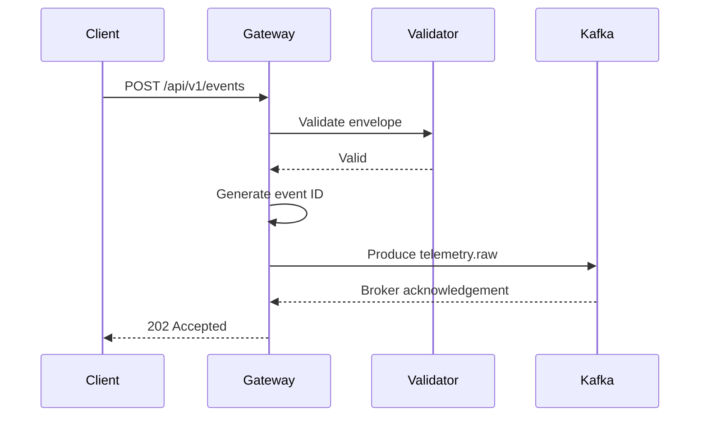

# Event Flow — v0.2.0

If Kafka is unavailable or the produce operation exceeds the configured timeout, the gateway returns `503 Service Unavailable` and does not claim the event was accepted.

This behavior is intentional: the HTTP boundary should not lie about durability.
