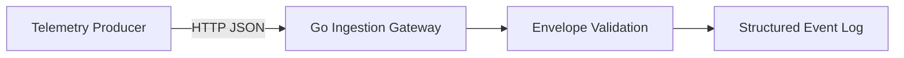

# TelemetryForge Architecture — v0.1.0

TelemetryForge v0.1.0 establishes the ingestion boundary and canonical telemetry envelope. The release intentionally contains no broker or persistence layer yet; accepted events are validated and emitted as structured logs.

## Design goals

1. Keep the ingestion service stateless so it can be replicated horizontally later.
2. Keep validation in the domain layer rather than the HTTP layer so Kafka replay, gRPC, and CLI ingestion can reuse the same rules.
3. Version the event envelope before introducing streaming infrastructure.
4. Fail malformed input at the edge rather than forwarding invalid telemetry downstream.
5. Use structured logging from the first release so the gateway is itself observable.

## Planned evolution

v0.2.0 replaces the structured-log sink with Kafka publishing. The HTTP contract and domain validation are expected to remain compatible.
