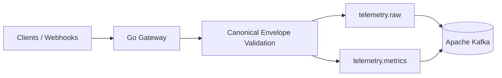

# TelemetryForge Architecture — v0.2.0

TelemetryForge v0.2.0 establishes a durable event-streaming boundary between HTTP ingestion and future stream-processing workers.

## Gateway responsibilities

The gateway remains stateless. It is responsible for request-size enforcement, strict JSON decoding, domain validation, event-ID assignment, topic routing, and durable publication to Kafka.

The gateway does **not** perform business aggregation, persistence, retry orchestration, or incident analysis. Those responsibilities are intentionally downstream so the ingestion tier can scale independently.

## Streaming boundary

Kafka decouples request concurrency from future worker throughput. In v0.2.0, the gateway waits for the producer acknowledgement before returning HTTP 202. In v0.3.0, consumer groups and bounded worker pools will be added downstream.

## Readiness

`/health` reports process liveness. `/ready` verifies Kafka reachability, so an orchestrator can avoid sending traffic to a gateway that cannot durably hand off accepted telemetry.

## Future evolution

The Kafka log will later provide the basis for replay, dead-letter handling, shadow pipelines, incident capture, and backpressure visibility.
